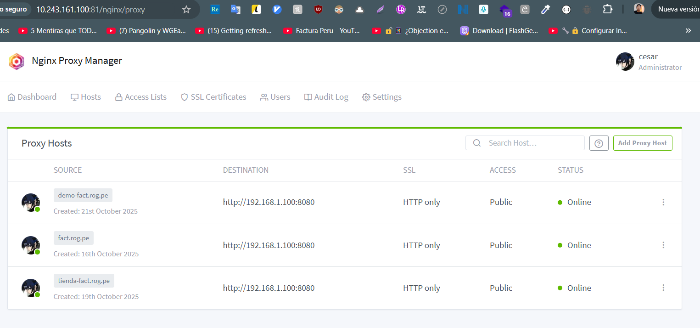
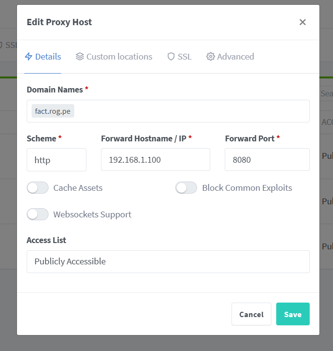
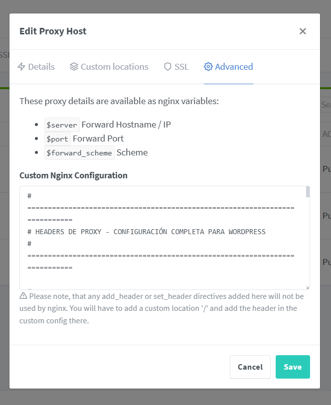

## Configurar ngproxy manager
Configurar nuestro servidor



--

--

--

la configuracion `Advanced/Custom Nginx Configuration`

```shell
# ============================================================================
# HEADERS DE PROXY - CONFIGURACIÓN COMPLETA PARA WORDPRESS
# ============================================================================

# ┌─────────────────────────────────────────────────────────────────────────┐
# │ 1. HEADERS BÁSICOS DE IDENTIFICACIÓN                                    │
# └─────────────────────────────────────────────────────────────────────────┘

# Host: Dominio real que el usuario escribió en el navegador
# Sin esto: WordPress ve "litespeed:8000"
# Con esto: WordPress ve "fact.rog.pe"
proxy_set_header Host $host;

# X-Real-IP: IP real del visitante (no la del proxy)
# Sin esto: WordPress ve "172.20.0.9" (IP de NPM)
# Con esto: WordPress ve "187.189.200.100" (IP real del usuario)
# ► Usado por: Analytics, seguridad, geolocalización, logs
proxy_set_header X-Real-IP $remote_addr;

# X-Forwarded-For: Lista completa de IPs en la cadena de proxies
# Mantiene trazabilidad: Usuario → Cloudflare → NPM → LiteSpeed
# Valor: "187.189.200.100, 104.21.50.25, 172.20.0.9"
# ► Usado por: CDN, debugging, compliance, auditorías
proxy_set_header X-Forwarded-For $proxy_add_x_forwarded_for;


# ┌─────────────────────────────────────────────────────────────────────────┐
# │ 2. HEADERS DE PROTOCOLO HTTPS (CRÍTICOS PARA EVITAR REDIRECT LOOPS)    │
# └─────────────────────────────────────────────────────────────────────────┘

# X-Forwarded-Proto: Protocolo original (http o https)
# ► CRÍTICO: Sin esto → Redirect Loop infinito 🔄
# Le dice a WordPress: "El usuario se conectó por HTTPS"
# Aunque NPM → LiteSpeed sea HTTP, WordPress sabe que es HTTPS al final
proxy_set_header X-Forwarded-Proto $scheme;

# X-Forwarded-Ssl: Específico para WordPress
# Alternativa/complemento a X-Forwarded-Proto
# Valores: "on" si es HTTPS, vacío si es HTTP
# ► WordPress lo chequea específicamente en wp-config.php
proxy_set_header X-Forwarded-Ssl on;


# ┌─────────────────────────────────────────────────────────────────────────┐
# │ 3. HEADERS DE HOST Y PUERTO                                             │
# └─────────────────────────────────────────────────────────────────────────┘

# X-Forwarded-Host: Host original (útil con múltiples proxies)
# Similar a Host, pero mantiene el valor original en cadenas largas
# ► Usado por: Configuraciones multi-dominio, subdominios
proxy_set_header X-Forwarded-Host $host;

# X-Forwarded-Port: Puerto original donde el usuario se conectó
# Sin esto: WordPress genera URLs como "https://fact.rog.pe:8000" ❌
# Con esto: WordPress genera URLs como "https://fact.rog.pe" ✅
# ► Evita: Puertos extraños en URLs, errores en redirects
proxy_set_header X-Forwarded-Port $server_port;
```