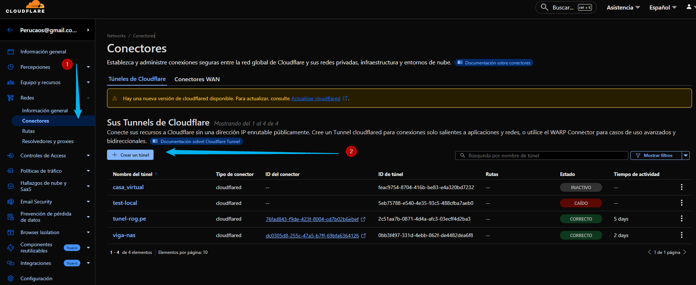
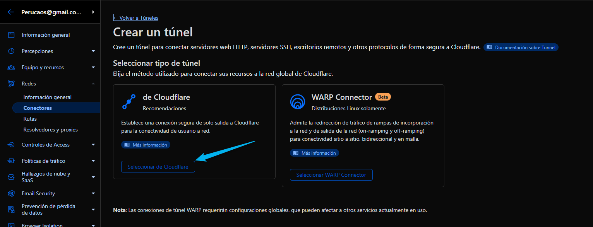
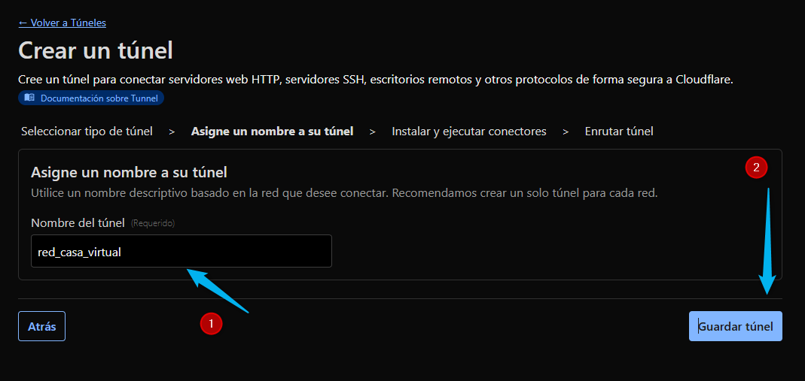
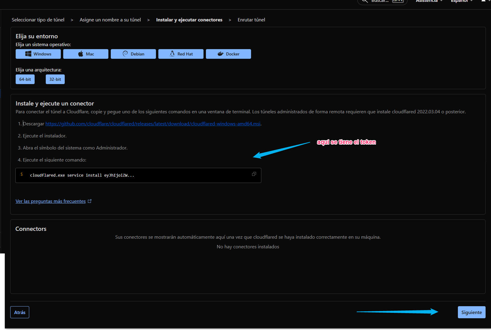

# 1. Crearemos en Tuner en la web de CloudFlare

## 1 crear una red 


-- -


-- -


-- -


-- -

```shell
# :aqui esta el token
cloudflared.exe service install eyJhIjoiZWRhMzFiNDk5ZGE4MWQ4Y2JhM2FkNGFhMzA0MWRjNzciLCJ0IjoiZGYzO....
```


```shell
docker run cloudflare/cloudflared:latest tunnel --no-autoupdate run --token eyJhIjoiZWRhMzFiNDk5ZGE4MWQ4Y2JhM2FkNGFhMzA0MWRjNzciLCJ0IjoiYTJmNmFlNmUtODk3My00OGJmLWIzZDEtNzY2NWY0OTVkMTA1IiwicyI6IlpUUm1NVGswTm1FdE1EZG1NQzAwT0dOaUxXSXlOV1V0TUdRMU5tRTRPVGt4WmpkaSJ9

```

- Crearemos la carpeta donde estara nuestro:
    - `mkdir /home/viga/cloudflare-tunel `
    - `cd /home/viga/cloudflare-tunel `
- Creacion de Contenedor
    - `touch docker-compose.yml`
    - `vi docker-compose.yml`


```shell
export TUNNEL_TOKEN=eyJhIjoiZWRhMzFiNDk5ZGE4MWQ4Y2JhM2FkNGFhMzA0MWRjNzciLCJ0IjoiNjY4ZmJjMjEtMDk5Yy00NGZkLTg2MWQtNDRjNmI4YTcxM2VmIiwicyI6Ik1qTTJZek0wWmpZdE5tSXhPQzAwT0RVMkxUaGlZMlV0TkRobU9EWmpaakExTm1WaiJ9

export TUNNEL_TOKEN=eyJhIjoiZWRhMzFiNDk5ZGE4MWQ4Y2JhM2FkNGFhMzA0MWRjNzciLCJ0IjoiMGJiM2Y0OTctMzMxZC00ZWJiLTg2MmYtZGU0NDgyZGVhNmY4IiwicyI6Ik5UUXpPR0kwTnpjdFkyRmtaUzAwTTJVd0xXSTFPR1F0TlRWak5UVmlNVGhsT1RjeCJ9

```

```yaml
version: "3.9"

# =========================================================
#  1. Le diremos que use la red que creamos anteriormente
# =========================================================
networks:
  network_cesar:
    external: true

services:
  cloudflaredtunel:
    image: cloudflare/cloudflared:2024.11.1
    container_name: naslocal
    restart: unless-stopped
    command: tunnel --no-autoupdate run
    environment:
      - TUNNEL_TOKEN=$TUNNEL_TOKEN
    networks:
      network_cesar:
        ipv4_address: 172.19.0.100

```

Desplegar
```shell
# =====================================================
# 3. Deploy contenedores
# =====================================================
docker-compose up -d
```


## Puedes despalegar mas  dominios

Aqui puedes  desplegar mas dominios en cloudflare a tu tunbnel


sudo rm -rf /home/viga/nextcloud/db-data/*
